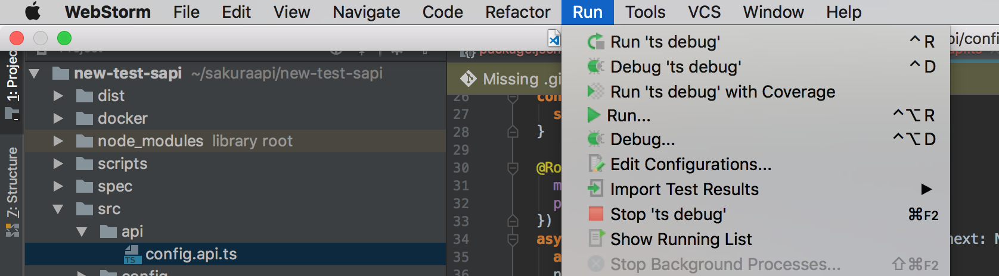
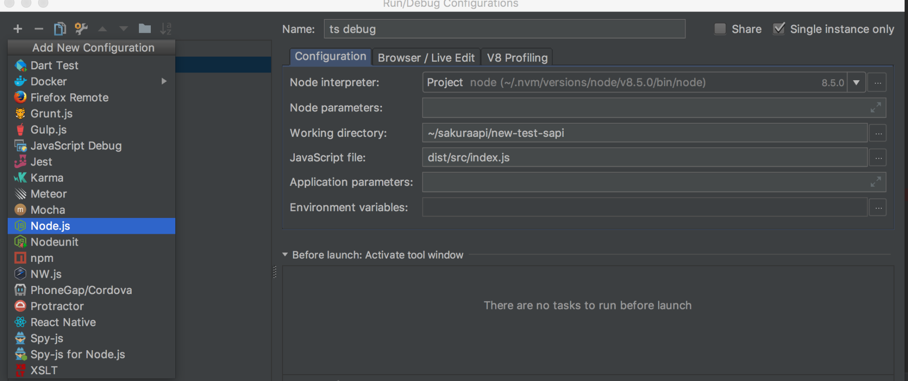
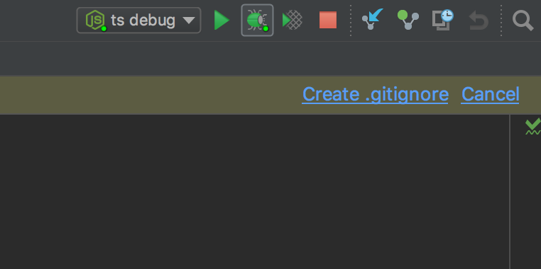
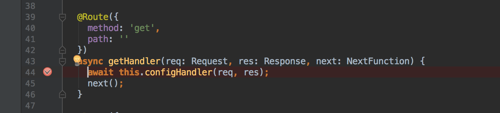
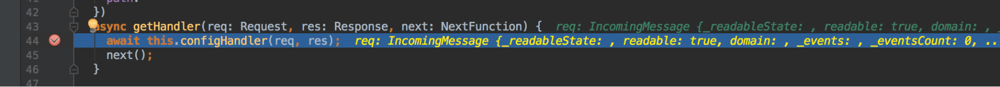
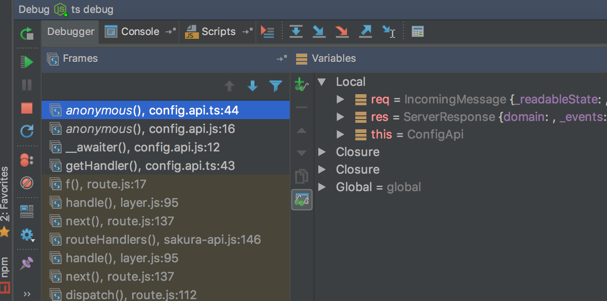

**Debug sakuraapi project right from webstorm**

Debugging from webstorm will save a lot time than traditional console logs.

Here is the list of steps to configure debugging your sakuraapi.

1. Click on Run select Edit configurations.

 

1. Click on + to create a new configuration and select js.

 

1. Name Your configuration. Ex: &quot;ts debug&quot;
2. Select Node Interpreter configuration from drop down.
3. Select init javascript file. Ex: &quot;dist/src/index.js&quot; for sakuraapi
4. Click on apply and k.

Voila! , Now your &quot;ts debug&quot;configuration is ready.

**How to debug a sakuraapi project from Webstorm.**

1. 1)Once &quot;ts debug&quot; is ready, start your project in debug mode by clicking on bug symbol.

 

2) Your sakuraapi project running in debug mode.set a breakpoint by clicking on empty space beside code space.

 

3) Hit that route in browser , you can see a hit to your breakpoint

 

4) You can see all the required information at that debug point.you can play with resume , step-in, step-out ,next-line and restart .

 

That&#39;s all folks